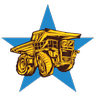

# 
 Mining 21   

 Educational app to raise awareness about the use of minerals in daily life.

---

[english](#english) - [español](#español)

  
  
  

  
  
  
  

## About 

_Educational app to raise awareness about the use of minerals in daily life._

| Android | iOS |
|:-:|:-:|
|   | Soon |

## Description

Application that aims to educate users about the use of minerals in everyday life.  
We aim to connect people with mining through this application to raise awareness about the use of miners in our daily lives.

The application consists of 4 levels:
1. Minerals in the House
2. Minerals in Medicine
3. Minerals in Transportation
4. Minerals in Agriculture.

Each level teaches us the importance of mining through the use of minerals used every day.

## Tech Stack

This app was built using [Flutter](https://flutter.dev/). To learn more about it you can read the [documentation](https://flutter.dev/docs).

---

## Acerca de 

_App educativa para Concientizar sobre el uso de los minerales en la vida diaria._

| Android | iOS |
|:-:|:-:|
|   | Próximamente |

## Descripción

Aplicación orientada a educar a los usuarios en cuanto al uso de los minerales en la vida cotidiana.  
Tenemos como objetivo el conectar a las personas con la minería a través de esta aplicación para concientizar sobre el uso de los minares en nuestra vida diaria.

La aplicación consta de 4 niveles:
1.	Minerales en el Casa
2.	Minerales en la Medicina
3.	Minerales en Transporte
4.	Minerales en la Agricultura.

Cada nivel nos enseña la importancia de la minería a través del uso de los minerales empleados todos los días.

## Tech Stack

Esta aplicación se creó con [Flutter](https://flutter.dev/). Para saber más al respecto, puedes leer su [documentación](https://flutter.dev/docs).
